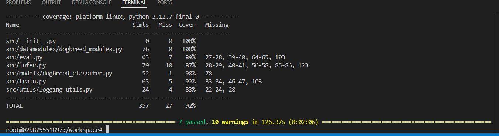
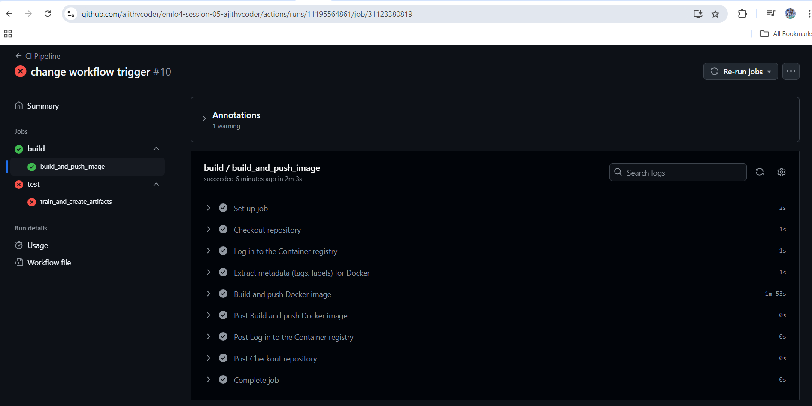
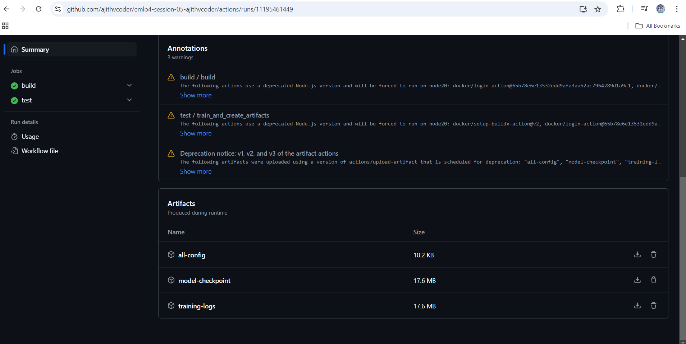
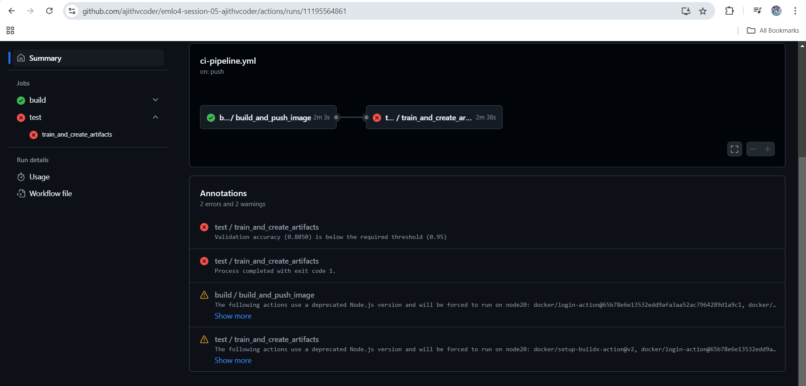

## EMLOV4-Session-05 Assignment - PyTorch Lightning - II

### Contents

**Note: I have completed the bonus point assignment also**

- [Requirements](#requirements)
- [Development Method](#development-method)
    - [Hydra Configuration](#hydra-configuration)
    - [Pytest and Coverage](#pytest-and-coverage)
    - [CI Pipeline Development](#ci-pipeline-development)
    - [Bonus Assignment](#bonus-points-hydra-and-test-and-ci-development)
- [Learnings](#learnings)
- [Results Screenshots](#results)

### Requirements

- Start from the repository of previous Session
- Start using Cursor!
- Create a `eval.py` with its config that tests the model given a checkpoint
- Integrate the `infer.py` you made in the last session with Hydra
- Make sure to integrate codecov in your repo, should be at least 70%
- Push the Docker Image to GHCR, it should show up in the Packages section of your repo

**Optional Assignment (Bonus Points - 500)**

- Create another GitHub Actions Workflow to use the Docker image created to train the cat-dog model for 5 epochs on a small backbone network
- Your actions should fail if accuracy is <95%
- Model Checkpoint, Model Logs, Config used, should be presented as artifacts

### Development Method

#### Build Command

**Image Build Command**

- `docker build -t light_train_test -f ./Dockerfile .`

**Run training and checkpoint stored in model_storage/**

- `docker run --rm -v /workspace/emlo4-session-05-ajithvcoder/:/workspace/ light_train_test python src/train.py`

**Run evaluation and results are printed**

- `docker run --rm -v /workspace/emlo4-session-05-ajithvcoder/:/workspace/ light_train_test python src/eval.py`

**Run Inference and results are stored in infer_images/**

- `docker run --rm -v /workspace/emlo4-session-05-ajithvcoder/:/workspace/ light_train_test python src/infer.py`

### Hydra Configuration

- Added `train.yaml`, `infer.yaml`, and `eval.yaml` for separate purposes
- There are two experiments: one for `dogbreed` and another for `catdog`
- In the data folder, there are also two: one for `catdog` and another for `dogbreed`, so we can experiment on multiple datasets and dataloaders
- There are two classifier models, each can be used for its purpose. We can also integrate them into one
- Similarly, `trainer`, `paths`, and `logger` are set, but they are common and usually won’t change
- In callbacks, we can declare the checkpoint `path`, `summary`, and `early stopping` criteria
- These criteria can be overridden from any YAML files. For example, I have overridden the values of `model_checkpoint` callback in `experiment/dogbreed_ex_train.yaml`
- By default, checkpoints are stored in the `model_storage` folder

### Pytest and Coverage

- Datamodules, models, and train, eval, and infer files are tested

**Order in which tests are run (eval should run after train)**

- Packages like `pytest-order` and `pytest-dependency` are used for readability and ordering
- Command: `pytest --collect-only -v`

**Overall Test Coverage Command**

- `pytest --cov-report term --cov=src/ tests/`

**Individual Module Test Command**

- `pytest --cov-report term --cov=src/models/ tests/models/test_timm_classifier.py`

### CI Pipeline Development

- Using GitHub Actions and the `docker-build.yml`, we are building the Docker image and pushing it to GitHub GHCR

### Bonus Points - Hydra and Test and CI Development

- Added an additional experiment `catdog_ex.yaml` with a MobileNet lightweight model, and it is used to trigger the `catdog` experiment

    ```bash
    python src/train.py --config-name=train experiment=catdog_ex trainer.max_epochs=5
    ```

- Manual tests are written in the workflow to collect logs and check the accuracy using the `grep` command. If the accuracy is more than 95%, it passes; otherwise, it fails. Results for both passing and failing cases are attached at the bottom
- Artifacts are stored using GitHub Actions in the pipeline run. You can view them in the results section
- In the CI pipeline (`ci-pipeline.yml`), first, `docker-build.yml` is triggered, then `docker-test.yml` is triggered. We can set the min accuracy and Docker image name as parameters to the `docker-test.yml` file

### Learnings

- Learnt about Hydra, Pytests, and artifact creation

### Results

- **Hydra Configs**
  - Located in the `configs` folder

- **Test Coverage Report**

    

- **Docker Image Build and Push**

    

- **Artifact Successful Generation with Accuracy Above 50%**

  [View Action Run](https://github.com/ajithvcoder/emlo4-session-05-ajithvcoder/actions/runs/11195461449)

    

- **Artifact Unsuccessful Generation with Accuracy Below 95%**

  [View Action Run](https://github.com/ajithvcoder/emlo4-session-05-ajithvcoder/actions/runs/11195564861)

    

### Group Members

1. Ajith Kumar V (myself)
2. Aakash Vardhan
3. Anvesh Vankayala
4. Manjunath Yelipeta
5. Abhijith Kumar K P
6. Sabitha Devarajulu
